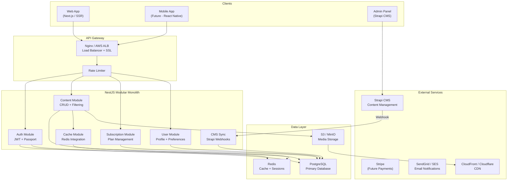

# Healthfulforu.com v2.0

> Backend prototype for a subscription-based health education platform.

## Table of Contents

- [Architecture Overview](#architecture-overview)
- [Tech Stack](#tech-stack)
- [Setup Instructions](#setup-instructions)
- [API Documentation](#api-documentation)
- [Project Structure](#project-structure)
- [Trade-offs](#trade-offs)
- [Leadership Questions](#leadership-questions)

---

## Architecture Overview

This is the full architecture design for the platform. for prototype purpose the code only cover :
1. Backend API(Content API, Auth API: Simple login/register)
3. Subscription flag
4. Database models + migrations
5. Headless CMS Strapi integration



### Key Architectural Decisions

1. **Modular Monolith** — All modules (auth, content, subscription, user, tag, cms-sync) live in one deployable unit. Simpler to operate for a small team, but a bad deploy takes everything down.

2. **NestJS + Strapi** — Strapi is the CMS for editors. NestJS handles auth, subscription gating, and content delivery. Content is synced to our own PostgreSQL via webhooks so we don't depend on Strapi for read traffic.

3. **PostgreSQL + Prisma** — Relational model with type-safe queries. Prisma's DX is good but has limitations (see [Trade-offs](#trade-offs)).

4. **In-memory cache** — A simple Map-based cache with 5-min TTL. Not Redis — despite the file naming. Good enough for a single-instance prototype.

5. **JWT Authentication** — Stateless tokens (15min access, 7d refresh). No server-side revocation — a known limitation documented below.

See [`docs/ARCHITECTURE.md`](./docs/ARCHITECTURE.md) for the full design document.

---

## Tech Stack

| Layer | Technology | Rationale |
|-------|-----------|-----------|
| **Runtime** | Node.js 20 | Async I/O suits read-heavy workloads |
| **Framework** | NestJS 10 | Modular DI, TypeScript-native |
| **ORM** | Prisma 5 | Type-safe queries, migrations |
| **Database** | PostgreSQL 16 | Relational model, JSONB |
| **Cache** | In-memory Map (not Redis yet) | Placeholder — swappable to Redis |
| **CMS** | Strapi | Headless CMS for editors, webhook sync |
| **Auth** | JWT + Passport | Stateless, no session store needed |
| **Docs** | Swagger/OpenAPI | Auto-generated from decorators |
| **Testing** | Jest + Supertest | 10 unit tests, E2E scaffold |
| **Container** | Docker Compose | Local dev only |

---

## Setup Instructions

### Prerequisites

- Node.js 20+
- Docker & Docker Compose
- npm

### 1. Backend Setup

```bash
# Clone the repository
git clone <repo-url>
cd convergence-study-case

# Start infrastructure (PostgreSQL + Redis)
docker compose up -d postgres redis

# Install dependencies
cd backend
npm install

# Generate Prisma client
npx prisma generate

# Run database migrations
npx prisma migrate dev

# Seed the database
npm run prisma:seed

# Start the development server
npm run start:dev
```

The API will be available at `http://localhost:3000/api/v1`
Swagger docs at `http://localhost:3000/api/docs`

### 2. Strapi CMS Setup

#### Step 1: Create Strapi v4 project

```bash
cd convergence-study-case
npx create-strapi-app@latest cms --quickstart --no-run
```

This creates a `cms/` folder with a full Strapi v4 project using SQLite by default.

#### Step 2: Start Strapi

```bash
cd cms
npm run develop
```

Strapi Admin will be available at `http://localhost:1337/admin`. Create your admin account on first visit.

#### Step 3: Create the `Article` content type

Go to Content-Type Builder → Create new collection type → `Article` with these fields:

| Field | Type | Notes |
|-------|------|-------|
| `title` | Short text | Required |
| `slug` | UID (from title) | Required, unique |
| `body` | Rich text | |
| `excerpt` | Long text | |
| `type` | Enumeration | Values: `ARTICLE`, `VIDEO` |
| `isPremium` | Boolean | Default: false |
| `thumbnailUrl` | Short text | |
| `videoUrl` | Short text | |
| `readTimeMinutes` | Integer | |

Save the content type — Strapi will restart automatically.

#### Step 4: Generate an API token

Strapi Admin → Settings → API Tokens → Create new token → **Full access** → copy the token and add it to `backend/.env`:

```
STRAPI_API_TOKEN=your-token-here
```

#### Step 5: Configure webhook

Strapi Admin → Settings → Webhooks → Add webhook:

- **URL**: `http://localhost:3000/api/v1/cms-sync/webhook`
- **Events**: Entry → Create, Update, Delete, Publish, Unpublish
- **Headers** (optional): add `x-strapi-signature` with your webhook secret if `STRAPI_WEBHOOK_SECRET` is set in `backend/.env`

### 3. Running the Full Stack

After both backend and Strapi are set up:

```bash
# Terminal 1 — infrastructure
docker compose up -d postgres redis

# Terminal 2 — backend API
cd backend
npx prisma migrate dev
npm run prisma:seed
npm run start:dev          # http://localhost:3000

# Terminal 3 — Strapi CMS
cd cms
npm run develop            # http://localhost:1337
```

### Test Accounts (after seeding)

| Email | Password | Role | Subscription |
|-------|----------|------|-------------|
| `admin@healthfulforu.com` | `Admin123!` | ADMIN | YEARLY |
| `editor@healthfulforu.com` | `Editor123!` | EDITOR | YEARLY |
| `premium@example.com` | `Premium123!` | SUBSCRIBER | MONTHLY |
| `free@example.com` | `FreeUser123!` | SUBSCRIBER | FREE |

### Running Tests

```bash
cd backend

# Unit tests
npm test

# E2E tests (requires running database)
npm run test:e2e

# Coverage report
npm run test:cov
```

---

## API Documentation

### Endpoints

| Method | Endpoint | Auth | Description |
|--------|----------|------|-------------|
| `GET` | `/api/v1/health` | No | Health check |
| `POST` | `/api/v1/auth/register` | No | Register new user |
| `POST` | `/api/v1/auth/login` | No | Login and get JWT tokens |
| `GET` | `/api/v1/users/me` | JWT | Get current user profile |
| `PUT` | `/api/v1/users/me/preferences` | JWT | Update content preferences |
| `GET` | `/api/v1/content` | Optional | List content (paginated, filterable) |
| `GET` | `/api/v1/content/:slug` | Optional | Get content by slug or ID |
| `GET` | `/api/v1/tags` | No | List all tags/topics |
| `GET` | `/api/v1/tags/:slug` | No | Get tag with associated content |
| `GET` | `/api/v1/subscriptions/me` | JWT | Get active subscription |
| `POST` | `/api/v1/subscriptions/upgrade` | JWT | Upgrade subscription plan |
| `DELETE` | `/api/v1/subscriptions/cancel` | JWT | Cancel subscription |
| `POST` | `/api/v1/cms-sync/webhook` | Webhook | Strapi CMS content sync |

### Content Gating Logic

- **Free content**: Full body/video available to all users
- **Premium content (non-subscriber)**: Returns excerpt + metadata, body/videoUrl set to `null`, `_gated: true`
- **Premium content (subscriber)**: Full body/video available, `_gated: false`

---

## Project Structure

```
convergence-study-case/
├── docs/
│   ├── ARCHITECTURE.md          # Full design document (Part 1)
│   ├── ERD.md                   # Entity relationship diagrams
│   └── architecture-diagram.mmd # Mermaid architecture diagram
├── backend/
│   ├── src/
│   │   ├── auth/                # JWT auth, register, login
│   │   ├── content/             # Content delivery + subscription gating
│   │   ├── subscription/        # Subscription management
│   │   ├── user/                # User profile + preferences
│   │   ├── tag/                 # Tags/topics
│   │   ├── cache/               # Redis cache service
│   │   ├── cms-sync/            # Strapi webhook handler
│   │   ├── common/              # Decorators, guards, DTOs
│   │   ├── prisma/              # Database service
│   │   ├── app.module.ts        # Root module
│   │   ├── main.ts              # Bootstrap
│   │   └── health.controller.ts # Health check
│   ├── prisma/
│   │   ├── schema.prisma        # Database schema
│   │   └── seed.ts              # Seed data
│   ├── test/                    # E2E tests
│   ├── Dockerfile               # Multi-stage production build
│   └── package.json
├── docker-compose.yml           # PostgreSQL + Redis + API + Strapi
└── README.md                    # This file
```

---

## Trade-offs

### Made These Choices

**1. Modular monolith over microservices**
- *Gain*: One thing to deploy, no service mesh, no network calls between modules.
- *Cost*: A bug in one module can crash the whole API. Modules share the database, so a bad migration affects everything. Extracting modules into services later will be harder than expected because of shared dependencies like `PrismaService`.
- *Why*: For a team of 1–3, microservices add operational cost without real benefit.

**2. NestJS over Laravel**
- *Gain*: TypeScript type safety, good Prisma/Passport integration, async I/O for read-heavy traffic.
- *Cost*: Smaller hiring pool than Laravel in APAC. Steeper learning curve for PHP developers.
- *Why*: Type safety and the Node.js ecosystem fit this use case better. But this is a real hiring trade-off.

**3. Prisma over TypeORM/Knex**
- *Gain*: Type-safe queries, auto-generated migrations, good DX.
- *Cost*: Can't control generated JOINs — nested `include` can produce N+1 queries. No native `INSERT ... ON CONFLICT` — our `upsertContent()` does two queries (find then create/update) instead of one atomic upsert. Migration folder gets messy after many iterations.
- *Why*: DX is worth it for a prototype with <100K rows. Would switch to raw SQL or Kysely if performance becomes a problem.

**4. JWT over sessions**
- *Gain*: Stateless, scales horizontally without sticky sessions.
- *Cost*: Compromised tokens can't be revoked — an attacker has up to 15 minutes of access. There's no server-side token blocklist. Refresh token rotation isn't implemented.
- *Why*: Acceptable risk for a prototype serving health articles. For production, we'd add a Redis blocklist and token rotation.

**5. Strapi CMS over custom admin panel**
- *Gain*: Editors get a CMS UI without us building one.
- *Cost*: Strapi's DB is a black box. Its webhook system has no retry queue or dead-letter handling. Major version upgrades (v4 → v5) have broken webhook payload formats before.
- *Why*: Building a custom admin panel is weeks of work we don't need for a prototype. Since content is synced to our own DB, Strapi can be replaced later without touching the NestJS API.

**6. In-memory cache (prototype) — not actually Redis**
- *Gain*: No Redis infrastructure to manage.
- *Cost*: Cache is lost on restart. Can't share cache across multiple instances. The file is named `redis-cache.service.ts` but it's a plain `Map` — there is no Redis connection in this prototype.
- *Why*: For a single-instance prototype, this works. The interface is the same, so swapping to a real Redis client is a one-file change.

**7. Content search — basic string matching only**
- *What we have*: Prisma's `contains` filter, which translates to `LIKE '%term%'`.
- *What we don't have*: No `tsvector` indexes, no relevance ranking, no Elasticsearch. Search will be slow on large datasets.
- *Why*: Not implemented in this prototype. For <10K articles, basic matching works. Production would need PostgreSQL full-text search at minimum.

### What I Would Change With More Time

- **Redis token blocklist** — enable instant revocation of compromised JWT tokens
- **Refresh token rotation** — issue new refresh token on each use, invalidate the old one
- **Rate limiting per user** — currently only global throttle; abusive users aren't individually limited
- **Atomic Prisma upserts** — replace find-then-create/update with raw `INSERT ... ON CONFLICT` for webhook sync
- **PostgreSQL full-text search** — add `tsvector` column + GIN index on content title/body
- **Audit logging** — track admin actions (role changes, content deletions) for compliance
- **CI/CD pipeline** — GitHub Actions for tests + lint + type check + deploy on merge
- **Stripe integration** — real payment processing instead of manual subscription management
- **Content recommendations** — personalized feed based on user preferences and reading history

---

## Leadership Questions

### 1. What would you build first in the first 30 days?

**Week 1-2: Foundation**
- Database schema, migrations, seed data
- Auth (register/login with JWT)
- Basic content API (list + fetch by ID)
- Subscription flag (free vs premium gating)
- Docker Compose for local development
- Swagger API docs

**Week 3: Content Pipeline**
- Strapi CMS setup for editorial team
- Webhook integration (Strapi → API)
- Redis caching for content lists
- Basic test suite (unit + E2E)

**Week 4: Polish & Deploy**
- Role-based access control
- Input validation and error handling
- Production Dockerfile
- Basic monitoring (health checks, logging)
- Deploy to staging environment

**Why this order?** Auth + content delivery is the core loop. If users can't register, browse, and see the subscription gate, nothing else matters.

### 2. What would you NOT build yet — and why?

| Feature | Why Not Yet |
|---------|------------|
| **Mobile app** | Web-first for faster iteration; API is mobile-ready when needed |
| **Payment integration (Stripe)** | Manual subscription management is fine for early users; adds complexity and PCI compliance requirements |
| **Real-time notifications** | Push notifications need mobile clients; email digests are sufficient initially |
| **Elasticsearch** | PostgreSQL full-text search handles <100K articles; migrate when content volume demands it |
| **Multi-language content** | Start with English in APAC; add i18n when there's demand data |
| **Social features** (comments, likes) | Not core to health education delivery; adds moderation overhead |
| **A/B testing infrastructure** | Premature optimization; use simple feature flags instead |
| **Custom analytics dashboard** | Use Google Analytics / Mixpanel initially; build custom when you understand what metrics matter |

Build what validates the business model first. Don't build infrastructure for scale you haven't reached.

### 3. What are the top 3 technical risks in this platform?

**Risk 1: Content delivery performance at scale**
- *Impact*: Slow responses lose readers.
- *Mitigation*: Real Redis caching (not the current in-memory stub), CDN for media, read replicas, cursor-based pagination.
- *Trigger*: p95 latency >500ms on content endpoints.

**Risk 2: Subscription bypass / content piracy**
- *Impact*: Revenue loss if premium content is scraped.
- *Mitigation*: Server-side gating (premium body is never sent to non-subscribers), rate limiting. Signed video URLs and fingerprinting are not implemented yet.
- *Trigger*: Anomalous API access patterns.

**Risk 3: CMS-to-API sync reliability**
- *Impact*: Editors publish content in Strapi but it doesn't appear on the site.
- *Mitigation*: Idempotent upserts (deduplicated by `strapiId`), full-sync endpoint as fallback. Webhook retry logic depends on Strapi — we don't control it. No monitoring dashboard exists yet.
- *Trigger*: Sync failures exceeding threshold in 1 hour.

### 4. How would you onboard a junior developer into this codebase?

**Day 1: Context**
- Walk through the architecture doc and ERD
- Explain the Strapi → NestJS content flow
- Run the project locally with Docker Compose

**Day 2-3: Guided tasks**
- Add a new field to the Content model (e.g., `language`)
- Write a Prisma migration and update the seed
- Add the field to the API response
- Write a unit test for the change

**Week 1: First feature**
- Pair program on a small feature (e.g., "sort content by view count")
- Review PR together, explain conventions

**Ongoing:**
- Code reviews on every PR with detailed feedback
- Keep the README and architecture docs updated
- Use TypeScript strictly — it's self-documenting
- Encourage asking questions in PR comments

The modular structure helps — a junior can work in one module (e.g., `tag/`) without understanding the whole codebase. But they'll still need to understand Prisma and the decorator patterns.

### 5. How would you ensure quality while moving fast?

1. **TypeScript strict mode** — catches many bugs at compile time
2. **Validation pipes** — all API inputs validated via DTOs before reaching business logic
3. **Unit tests** — 10 tests covering auth and content gating; not comprehensive yet
4. **E2E test scaffold** — structure exists but needs more coverage
5. **PR reviews** — no merge without review
6. **Swagger/OpenAPI** — API docs auto-generated from decorators
7. **Docker Compose** — consistent local environment
8. **CI pipeline** — not set up yet; would add GitHub Actions for tests + lint + type check

Feature flags, Sentry, and structured logging (Pino) are mentioned in the architecture doc as future additions — they're not implemented in this prototype.
