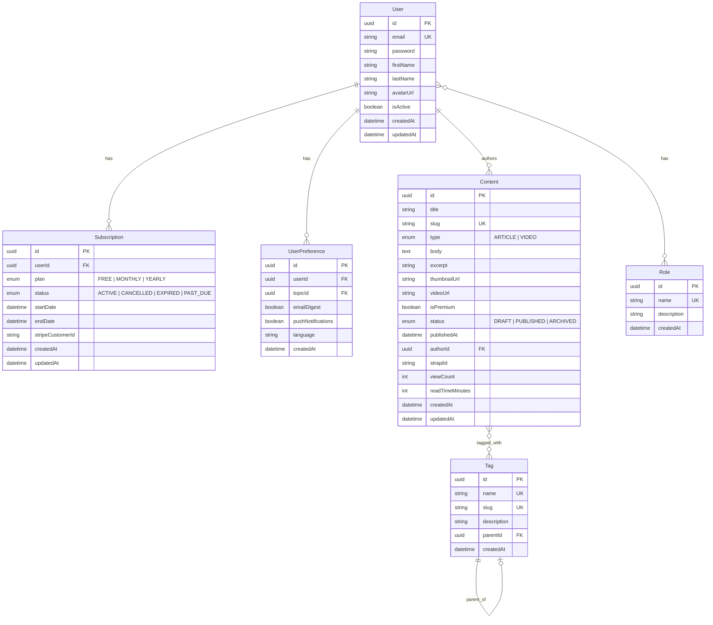

# Healthfulforu.com v2.0 — Entity Relationship Diagram

## Mermaid ERD

## Index Strategy

| Table | Index | Type | Purpose |
|-------|-------|------|---------|
| `User` | `email` | UNIQUE | Login lookup |
| `Content` | `slug` | UNIQUE | URL-friendly content access |
| `Content` | `status, publishedAt` | COMPOSITE | Published content listing |
| `Content` | `type, isPremium` | COMPOSITE | Content filtering |
| `Content` | `authorId` | BTREE | Author's content lookup |
| `Tag` | `slug` | UNIQUE | Tag URL lookup |
| `Subscription` | `userId, status` | COMPOSITE | Active subscription check |
| `UserPreference` | `userId` | BTREE | User preferences lookup |
